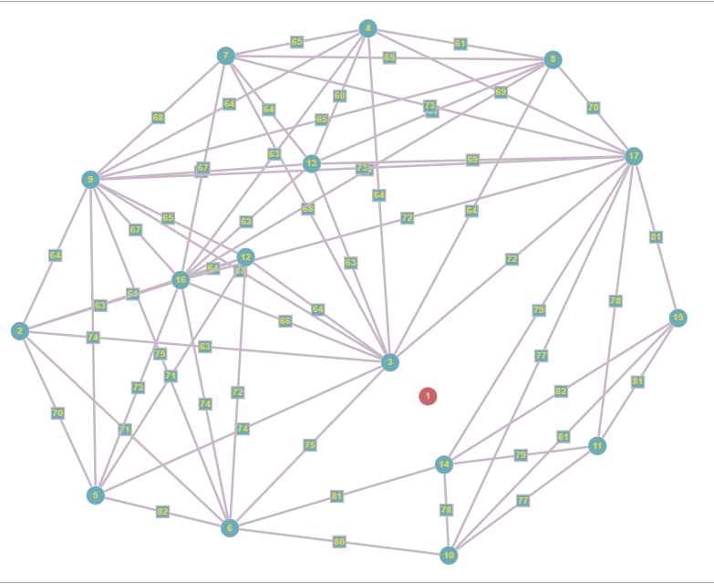
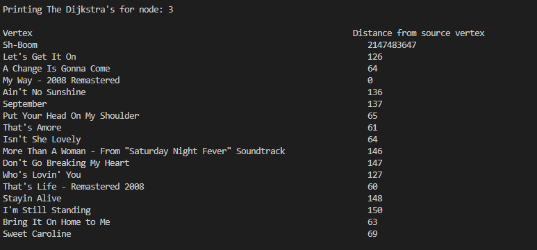

# CS 225 Final Project Writeup
Niketh Lakshmanan, Wyatt Wethington, Arnav Sheth, Nathan Parekh

---

At the start of our project, we identified the first goal of our project, using Python to pull data from Spotify's API. We began by researching the Spotify API and familiarizing ourselves with the different endpoints and the data they provided. We then identified the specific data we wanted to collect and the exact endpoints that contained that data. Next, we set up our development environment using Python and the Spotify API library. We then used the library to authenticate our application and obtain an access token. We used this access token to make requests to the Spotify API and retrieve the data we needed. Upon retrieval of the data, we had functions to parse the larged jumbled data into readable data, with “;” separating the songs and the corresponding data members of each song. This program is also easily customizable; the hyperlink in the “getURL” function of the Python needs to be swapped with the hyperlink of another Spotify playlist.

We worked on creating a graph class using an adjacency matrix in C++ to store data we pulled from Spotify. We began by creating a class for the graph itself, as well as functions to manage the data stored in the matrix. We used a two-dimensional array to store the data, with each row representing a node and each column representing an edge. In order to make sure the data was properly stored, we implemented a number of checks and balances, including validating the input data, ensuring the data was consistent, and automatically resizing the matrix when necessary. Once the data was properly stored, we wrote several functions to help us traverse the graph. We wrote functions in the Graph class that allowed us to add nodes and add weights between 2 nodes, using an algorithm and formula that we devised which arbitrarily calculates the similarity between two songs given only the name, artists, and genres. We measured the validity of this class by running the member functions on multiple different datasets (which were different playlists from Spotify).

In the Graph class, we had an addNode and addWeight function which would take in the song we wished to input and add it into the graph. The addWeight function determines the weight, which is the mean popularity between the two given input songs, and it sets the weight to this value in the adjacency matrix.

This will save the file in demofile2.txt which can be changed to your own personal file name if you want to. However this is the extent to which  we use python. 

We now switch to C++ where we use the MP_Schedule file parsing algorithms as it is. We even use the V2D file_to_v2d from the MP. We have defined the class Graph with the number of nodes as numVertices, a double vector of int to save the values as an adjacency matrix, a vector of string to save the name of the songs, a vector of all the popularity. 

We used Dijkstra’s to find similar songs with popularity. Spotify gives a numeric value for the popularity of the song with 0 being the most popular song and 100 being the least popular song. This gives us the ability to link multiple popular songs closer to each other. If the node is not connected to the graph in any way then it gives out INT_MAX. The dijkstra’s algorithm keeps a check on whether if we have visited that node or not and prevent infinite loop. This algorithm only fails if there are any negative values as the edge however the spotify api only returns values between 0 and 100. The Dijksta's algorithm helps us design a good structure between a point and the graph. This algorithm helps in connecting the 2 most popular songs.

Next, we used the BFS algorithm to traverse the graph and find the shortest path between the source node and the end node. To do this, we used a queue data structure to store the nodes to be visited. We began by adding the source node to the queue and then looping through the adjacency matrix, checking for any connected nodes. For each connected node, we added it to the queue and marked it as visited. We then repeated this process until the end node was reached. Finally, we counted the number of edges we took to reach the end node from the source node by incrementing each time a node was visited. Every time a backtravel occurred, the return value was decremented. This gave me the total number of edges taken to reach the end node from the source node. Overall, implementing BFS on an unweighted graph containing Spotify songs as nodes made using an adjacency matrix to find the number of edges taken to find the end node from the source node was fairly straightforward. By using a queue data structure and looping through the adjacency matrix, we were able to easily traverse the graph and count the number of edges taken to reach the end node from the source node.

We implemented the betweenness centrality algorithm on a graph constructed from an adjacency matrix, where each node represented a Spotify song. To do this, we first created the graph by mapping out the edges between the nodes in the adjacency matrix. We then calculated the shortest paths between each pair of nodes in the graph, using Dijkstra's algorithm to find the paths with the lowest cost. Once all the shortest paths were found, we calculated the betweenness centrality for each node in the graph by counting the number of times a node appeared in the shortest paths. This allowed us to get a better understanding of which songs were the most influential in the network, as songs with higher betweenness centrality scores would be more connected to other songs in the network. Through this analysis, we were able to identify songs that were important to the overall structure of the graph, and were thus influential in determining the flow of information in the network.

Our project helped to answer the question of how to find similarity in songs in a playlist by constructing a graph with nodes representing songs, and an adjacency matrix to show connections between songs. We then ran BFS and Dijkstra’s algorithms, as well as Betweenness Centrality, to help identify the most central songs in the playlist. Using these algorithms, we were able to identify the most popular songs in the playlist. By running BFS and Dijkstra’s, we were able to find the paths between songs, and the most direct path between two songs. By using Betweenness Centrality, we were able to identify the most important songs (by popularity) in the playlist. Overall, our project provided a useful way of finding similarity in songs in a playlist. It allowed us to easily visualize the relationships between songs, and to identify the most important songs in the playlist. Additionally, it allowed us to identify the most direct path between two songs, and to quickly identify the most popular songs. All of these features make our project a great tool for finding similarity in songs in a playlist.

